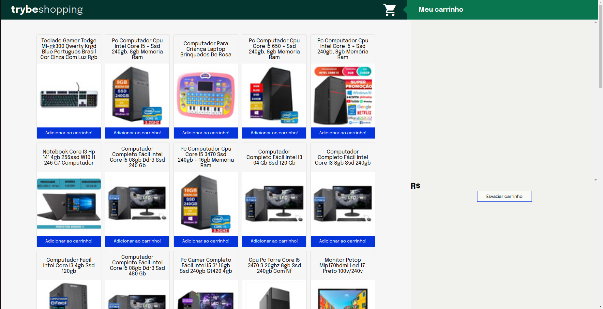

# Shopping Cart Project!

## Description

In this project, a fully dynamic shopping cart was developed, consuming data directly from an API. The Mercado Livre API was used to search for products for sale.
Project developed during the Trybe software development course.

## Tools

- Javascript ES6;
- HTML5;
- CSS3;
- Jest

## Skills Developed

- Make requests to an API (Application Programming Interface) from Mercado Livre;
- Use of JavaScript, CSS and HTML;
- Use of asynchronous functions;
- Implementation of unit tests.
